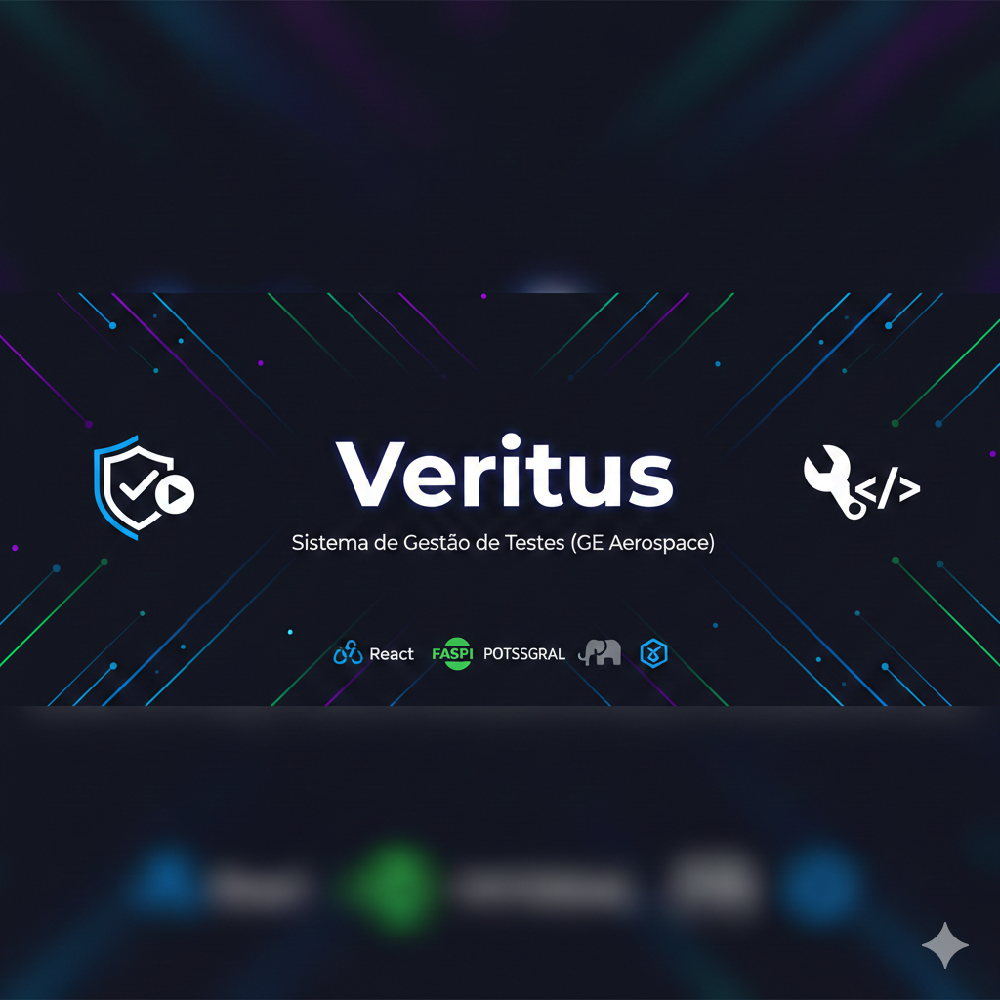

<p align="center">
  
</p>

# 🚀 Veritus: Sistema de Gestão de Testes

O **Veritus** é uma aplicação Full Stack desenvolvida para otimizar e profissionalizar o fluxo de **testes manuais**. Ele oferece uma estrutura robusta para organizar o gerenciamento de sistemas, módulos e casos de teste, garantindo rastreabilidade e qualidade em cada entrega.

Este projeto reflete o compromisso com a metodologia e o rigor técnico, aplicando conceitos de arquitetura limpa e automação de infraestrutura para resolver problemas reais de QA.

---

## 🛠️ Stack Tecnológica

O projeto utiliza tecnologias de ponta para garantir performance assíncrona e isolamento de ambiente:

* **Backend:** [FastAPI](https://fastapi.tiangolo.com/) (Python 3.11) com SQLAlchemy e migrações via **Alembic**.
* **Frontend:** [React](https://reactjs.org/) para uma interface dinâmica e intuitiva.
* **Banco de Dados:** [PostgreSQL 15](https://www.postgresql.org/) rodando em container dedicado.
* **Infraestrutura:** **Docker** e **Docker Compose** para orquestração completa de serviços.
* **Ferramentas de Apoio:** **pgAdmin** para gestão de dados e **Mailtrap** para testes de fluxo de e-mail.

---

## 🏗️ Arquitetura e Organização

A lógica do sistema segue uma hierarquia pensada para a rotina de análise de qualidade:

1. **Sistemas:** O software principal sob análise.
2. **Módulos:** Divisões lógicas das funcionalidades dentro de cada sistema.
3. **Casos de Teste:** Detalhamento de passos, prioridades e validação de resultados esperados.

### Estrutura de Pastas (Backend)

```text
app/
├── api/v1/         # Rotas e endpoints da API
├── models/         # Modelos SQLAlchemy (representação do banco)
├── schemas/        # Validação de dados com Pydantic
├── services/       # Camada de lógica de negócio
├── repositories/   # Abstração do acesso ao banco de dados
└── main.py         # Ponto de entrada da aplicação FastAPI

```

---

## 🚀 Como Executar

O projeto está configurado para subir totalmente via Docker, garantindo que todos os serviços funcionem em harmonia sem configurações manuais complexas.

### 1. Clonar o Repositório

```bash
git clone https://github.com/RTIC-STEM/2025_2_GE_Projeto_Nome
cd 2025_2_GE_Projeto_Nome

```

### 2. Iniciar os Containers

```bash
docker-compose up --build

```

### 3. Acessar os Serviços

* **Aplicação (Frontend):** [http://localhost:3000](https://www.google.com/search?q=http://localhost:3000)
* **Documentação Interativa (Swagger):** [http://localhost:8000/docs](https://www.google.com/search?q=http://localhost:8000/docs)
* **Gerenciador do Banco (pgAdmin):** [http://localhost:5050](https://www.google.com/search?q=http://localhost:5050)

---

## 👥 Autores

Este projeto é fruto do trabalho colaborativo de:

* **Luiz Fernando**
* **Isaque Perez**
* **Diego Couto**
* **Igor Giamattey**
* **Kevin Christian**


